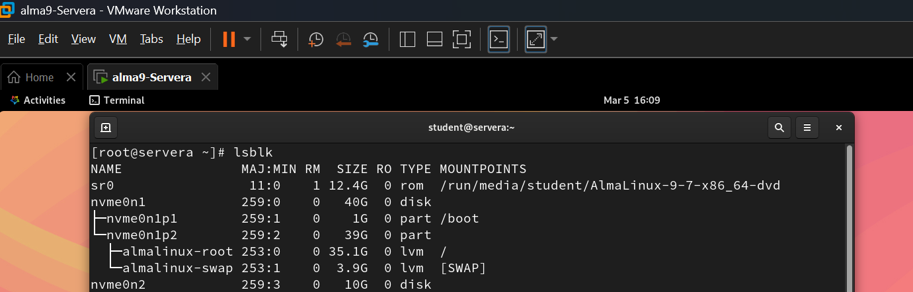
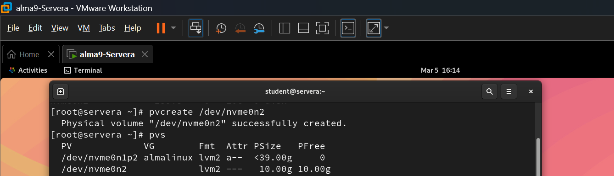
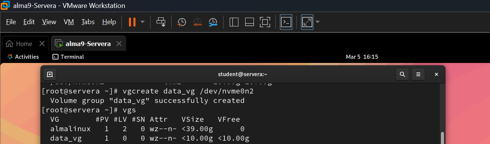
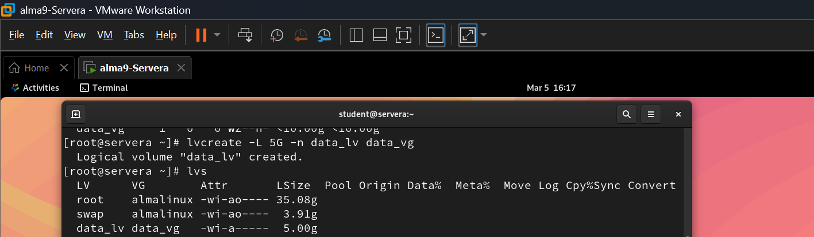
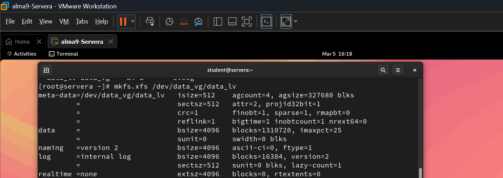
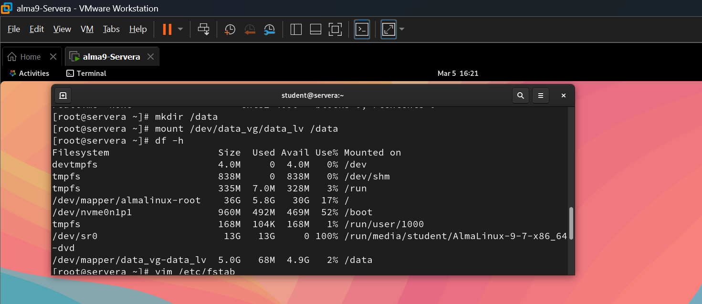
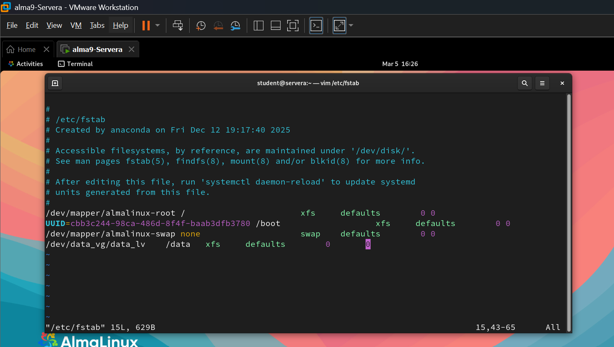
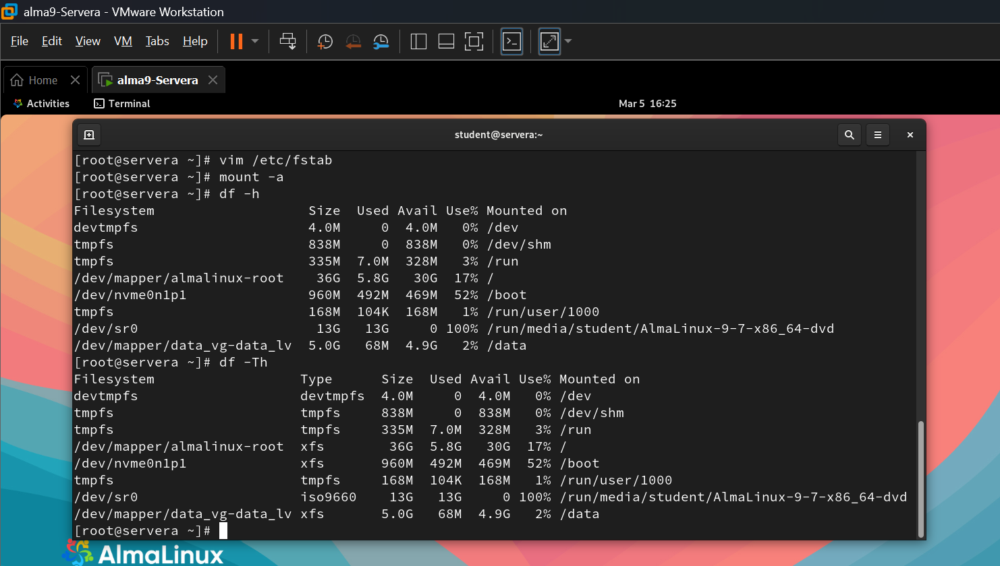

# RHCSA LVM Storage Project

## Project Overview
This project demonstrates **Logical Volume Management (LVM)** configuration on a Linux server using **AlmaLinux / RHEL-based systems**.

The goal of this project is to practice **RHCSA storage administration tasks** that are commonly required in real production Linux environments.

The lab includes creating and managing:

* Physical Volumes (PV)
* Volume Groups (VG)
* Logical Volumes (LV)
* Filesystems
* Persistent Mount Points
* Logical Volume Extension

This project helps build **practical Linux storage management skills required for RHCSA and DevOps roles.**

## Lab Environment
| Component          | Details                      |
| ------------------ | ---------------------------- |
| Operating System   | AlmaLinux 9                  |
| Platform           | VMware Workstation           |
| Storage Type       | Virtual Disks                |
| Storage Management | LVM (Logical Volume Manager) |

## LVM Architecture
The storage structure implemented in this project:

Disk (/dev/nvme0n2)
⬇
Physical Volume (PV)
⬇
Volume Group (VG) – data_vg 
⬇
Logical Volume (LV) – data_lv 
⬇
Filesystem (XFS)
⬇
Mount Point (/data)

## Step 1 — Verify Available Disks

Check the available disks before creating LVM.

lsblk

Screenshot:

## Step 2 — Create Physical Volumes

Create physical volumes from the new disks.

pvcreate /dev/nvme0n2

Verify PV creation:

pvs

Screenshot:

## Step 3 — Create Volume Group

Create a volume group using the physical volumes.

vgcreate data_vg /dev/nvme0n2

Verify:

vgs

Screenshot:

## Step 4 — Create Logical Volume

Create a logical volume inside the volume group.

lvcreate -L 5G -n data_lv data_vg

Verify:

lvs

Screenshot:

## Step 5 — Create Filesystem

Format the logical volume with an XFS filesystem.

mkfs.xfs /dev/data_vg/data_lv

Screenshot:

## Step 6 — Mount Filesystem

Create a mount directory.

mkdir /data

Mount the logical volume.

mount /dev/data_vg/data_lv /data

Verify:

df -h

Screenshot:

## Step 7 — Configure Persistent Mount

Add the mount entry to `/etc/fstab`.

/dev/vg_data/lv_data /data xfs defaults 0 0

Test the configuration:

mount -a

Screenshot:

## Step 8 — Extend Logical Volume

Increase logical volume size.

lvextend -L +2G /dev/data_vg/data_lv

Resize the filesystem.

xfs_growfs /data

Verify the new size.

df -h

## Useful LVM verification commands:

pvs        # Display summary of Physical Volumes
pvdisplay  # Detailed Physical Volume information

vgs        # Display summary of Volume Groups
vgdisplay  # Detailed Volume Group information

lvs        # Display summary of Logical Volumes
lvdisplay  # Detailed Logical Volume information

lsblk      # Show block devices and mount points

df -h      # Show disk usage in human-readable format
df -Th     # Show filesystem type and disk usage

## Skills Demonstrated

* Linux Storage Administration
* Logical Volume Management (LVM)
* Filesystem Management
* Disk Partitioning
* Persistent Mount Configuration
* Storage Expansion

## Author

**Bibin Mathew Varughese**

* RHCSA Certified
* Linux / DevOps Enthusiast
